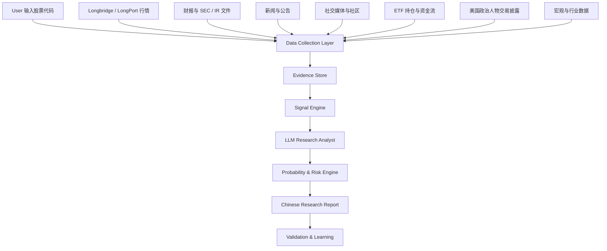

# 02 系统架构设计

## 1. 总体架构



## 2. 核心链路

Athena 的核心链路必须保持简单：

```text
Data
↓
Evidence
↓
Signals
↓
LLM Research
↓
+20% / -10% Probability
↓
Chinese Report
↓
Historical Validation
```

任何新模块如果不能提升上面链路的判断准确性，不应加入。

## 3. 模块职责

### 3.1 Data Collection Layer

负责收集资料，不做研究判断。

数据包括：

- K 线 / OHLCV
- 公司财报
- 估值数据
- 一致预期
- 新闻公告
- 社交热度
- ETF 持仓变化
- 机构持仓
- 政治人物交易披露

### 3.2 Evidence Store

负责保存证据：

- source
- timestamp
- symbol
- evidence_type
- claim
- value
- confidence
- url / file reference

Evidence Store 不输出投资结论。

### 3.3 Signal Engine

把 Evidence 转换成研究信号：

- 技术面信号
- 基本面信号
- 估值信号
- 催化剂信号
- 消息面信号
- 资金流信号
- 情绪信号
- 风险信号

### 3.4 LLM Research Analyst

LLM 的职责不是乱猜，而是：

- 阅读结构化 Evidence
- 解释信号之间的关系
- 判断 +20% 上行路径
- 判断 -10% 下行风险
- 生成中文报告
- 明确哪些结论证据不足

LLM 不直接访问 Broker，不下单。

### 3.5 Probability & Risk Engine

输出：

- upside_probability_range
- downside_probability_range
- confidence
- candidate_status
- risk_alert

第一版可以采用规则 + LLM 解释；后续通过 historical cases 校准。

### 3.6 Validation & Learning

验证过去案例：

- 是否先涨 +20%
- 是否先跌 -10%
- 用时多少天
- 最大回撤
- 判断是否正确
- Candidate 胜率是否高于 33.3%

## 4. 推荐目录结构

```text
athena/
  cli.py
  config.py
  data/
    longbridge_market.py
    filings.py
    news.py
    social.py
    etf_holdings.py
    political_trades.py
  evidence/
    models.py
    store.py
    normalizer.py
  signals/
    technical.py
    fundamentals.py
    valuation.py
    catalysts.py
    sentiment.py
    flow.py
    risk.py
  llm/
    analyst.py
    prompts.py
    schema.py
  probability/
    engine.py
    calibration.py
  reports/
    chinese_report.py
  validation/
    cases.py
    outcomes.py
    metrics.py
  outputs/
```

## 5. 架构原则

1. 数据层不做结论。
2. 信号层不做买卖建议。
3. LLM 只基于 Evidence 分析。
4. 所有结论必须能追溯到证据。
5. 输出全中文。
6. 不做自动交易。
7. 不为了架构好看而新增模块。
